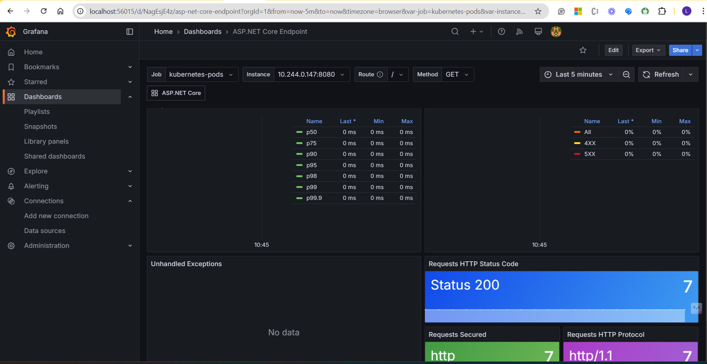

**Adding Monitoring:**

kubectl create ns prometheus

helm repo **add** prometheus-community https://prometheus-community.github.io/helm-charts
helm repo update

helm install prometheus prometheus-community/prometheus -n prometheus

**Copy the prometheus server name from the prompt**

*http://prometheus-server.prometheus.svc.cluster.local:80*

helm repo add grafana https://grafana.github.io/helm-charts

helm install grafana grafana/grafana -n prometheus

kubectl port-forward -n prometheus prometheus-prometheus-kube-prometheus-prometheus-0 9090

kubectl port-forward -n prometheus grafana 3000

https://learn.microsoft.com/en-us/dotnet/core/diagnostics/built-in-metrics-aspnetcore

https://grafana.com/grafana/dashboards/19925-asp-net-core-endpoint/

