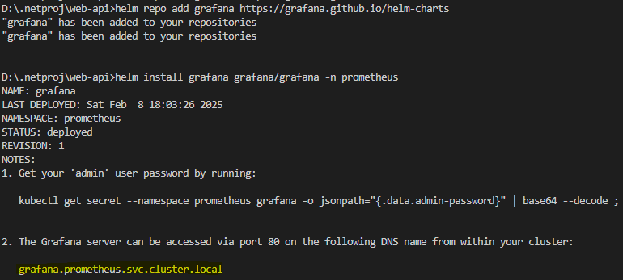
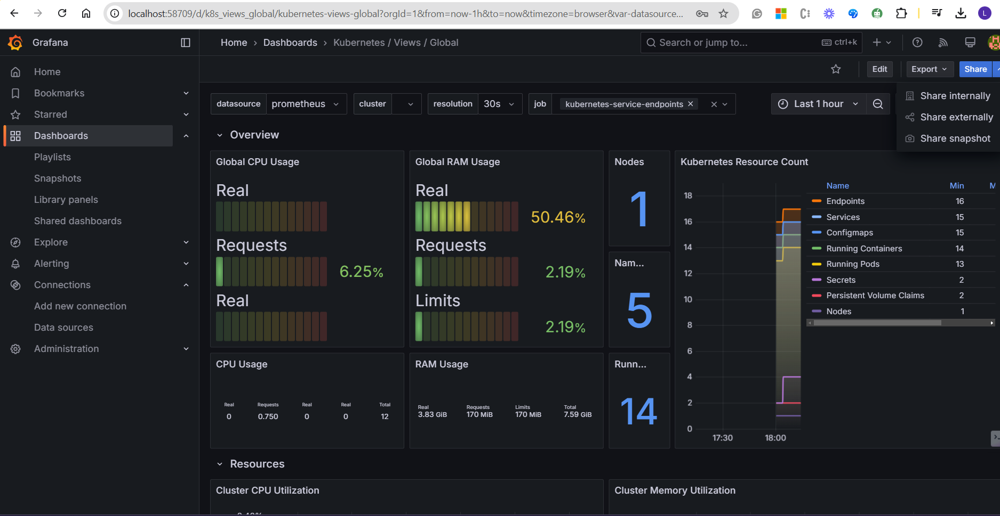

**Docker Locally**

docker build -t stalin-web-api .

docker run -d -p 8087:80 --name 1 firstapp

docker run -d -p 8087:8080 --name stalin-myfirst-web1 loyolastalin/stalin-web-api:v1

docker run -d -p 8082:8080 -e sqldb-connection-string="connection string"  --name sqltest sqltest

docker build -t loyolastalin/stalin-web-api:v2 .

docker push loyolastalin/stalin-web-api:v3

**validate the container files**

docker exec -it first sh

**Minikube**

minikube start

minikube service web-api-service --url

**AKS:**

az aks get-credentials --name demoaks --resource-group aks-prod

az aks enable-addons --addons azure-keyvault-secrets-provider --name demoaks --resource-group aks-prod

kubectl get pods -n kube-system -l ‘app in (secrets-store-csi-driver, secrets-store-provider-azure)’

kubectl exec busybox-secrets-store-inline-system-msi -- ls /mnt/secrets-store/

kubectl exec busybox-secrets-store-inline-system-msi -- cat /mnt/secrets-store/mysql-password

*Create Key Valut with the access permission option not with the RBAC option, and create a key with sqldb-connection-string and Azure DB connection string*

**Verify the current Context:**
kubectl config current-context

kubectl apply -f k8s\

kubectl exec -it web-api-deployment-65d6966d94-qzpwp -- /bin/sh

**Create Database**

CREATE DATABASE product;

**create table**

**CREATE**TABLE products **(**
    product_id **INT**PRIMARY**KEY**,
    product_name **VARCHAR**(**255**)**NOT**NULL**,**
    description **TEXT**,
    price **DECIMAL**(**10**,**2**)**NOT**NULL**,**
    category **VARCHAR**(**100**)**,**
    stock_quantity **INT**DEFAULT**0**,
    created_at **DATE **DEFAULT**CURRENT_TIMESTAMP**
**)**;

**Insert records**

**INSERT**INTO products **(**product_id**,** product_name**,** description**,** price**,** category**,** stock_quantity**)**VALUES
**(**1**,**'Wireless Headphones'**,**'Noise-cancelling Bluetooth headphones'**,**129.99**,**'Electronics'**,**50**)**,
**(**2**,**'Organic Coffee Beans'**,**'Single-origin medium roast coffee'**,**15.50**,**'Food'**,**100**)**,
**(**3**,**'Running Shoes'**,**'Lightweight athletic shoes for men'**,**89.99**,**'Footwear'**,**75**)**,
**(**4**,**'Leather Wallet'**,**'Genuine leather bifold wallet'**,**45.00**,**'Accessories'**,**30**)**,
**(**5**,**'Smart Watch'**,**'Fitness tracking smartwatch with heart rate monitor'**,**199.99**,**'Electronics'**,**40**);

**Adding Monitoring:**

kubectl create ns prometheus

helm repo **add** prometheus-community https://prometheus-community.github.io/helm-charts
helm repo update

helm install prometheus prometheus-community/prometheus -n prometheus

helm repo add grafana https://grafana.github.io/helm-charts

helm install grafana grafana/grafana -n prometheus

kubectl port-forward -n prometheus prometheus-prometheus-kube-prometheus-prometheus-0 9090

kubectl port-forward -n prometheus grafana 3000

